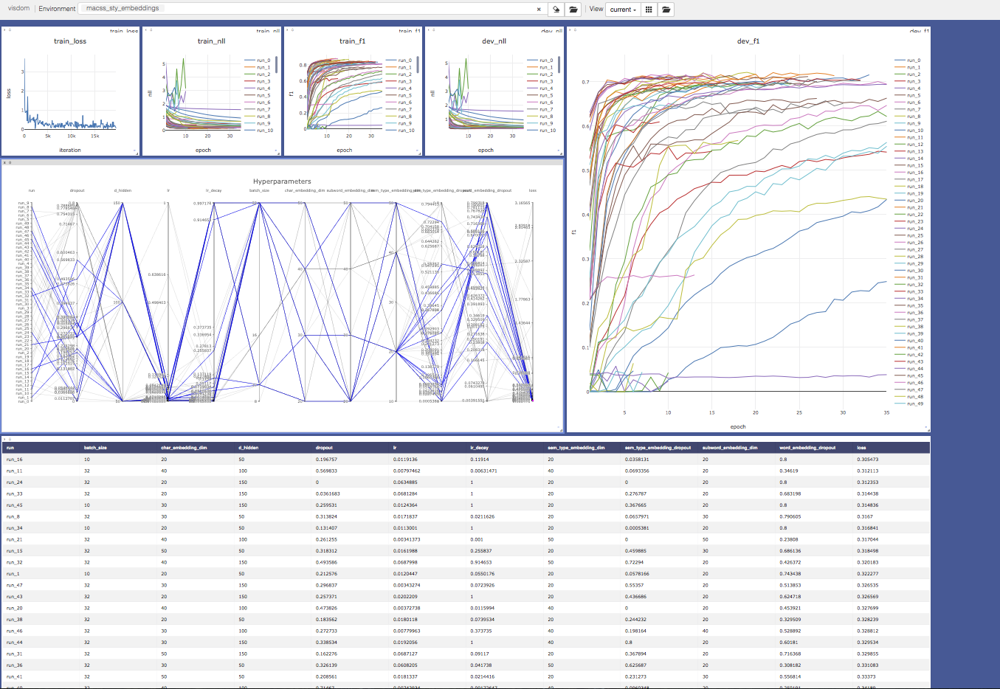

# PyTorch Quasar

## Installation

### As dependency in other projects
``` pip install --process-dependency-links git+ssh://git@github.com/ChristophAlt/pytorch-quasar.git ```

### Development
Clone the repository, followed by:

``` pip install -r requirements.txt ```

## Description

PyTorch Quasar aims to provide a toolkit for quickly prototyping and evaluating deep learning models with PyTorch. In order to achieve this goal, the libary must provide the following functionalities.

#### NLP related functionality
Most NLP tasks require the same basic functionality, such as loading text datasets and word vectors, quickly encoding text into a numerical representation and dynamic batching of sequential input.

#### Model Training
Train PyTorch models for arbitrary tasks, with and without supervision and with arbitrary many loss functions
given the same training framework. Callbacks provide extensibility and functionality such as Early Stopping and Checkpointing.

#### Hyperparameter Optimization
On top of the training framework, hyperparameter optimization capabilities are provided, offering different approaches such as Grid Search, Random Search, Bayesian optimization (Gaussian Processes, TPE) and bandits (e.g. Hyperband).

#### Visualization
Visualizing the training progress and results of the hyperparameter tuning are an essential part of a machine learning pipeline and must be available out of the box.
<p align="center"></p>

#### Experiment tracking
Persisting experiment results (e.g. hyperparameter tuning) is important to keep track of progress and already explored parameter configurations.

Though the main focus lies on NLP related tasks, there is no limitation that prevents it from beeing used for other tasks.

## Dependencies
Quasar combines various PyTorch libraries:

#### Pytorch-NLP
The library provides a basic set of NLP related functions, such as dataset loaders, word vector loaders, text
samplers and metrics. 

- Github: https://github.com/PetrochukM/PyTorch-NLP
- Docs: https://pytorchnlp.readthedocs.io/en/latest/

#### ignite
Ignite is a high-level library to help with training neural networks in PyTorch.

- Github: https://github.com/pytorch/ignite

#### skopt
skopt is a library to minimize expensive and noisy black-box functions.

- Github: https://github.com/scikit-optimize/scikit-optimize
- Docs: https://scikit-optimize.github.io/

#### visdom
A flexible tool for creating, organizing, and sharing visualizations of live, rich data.

- Github: https://github.com/facebookresearch/visdom
